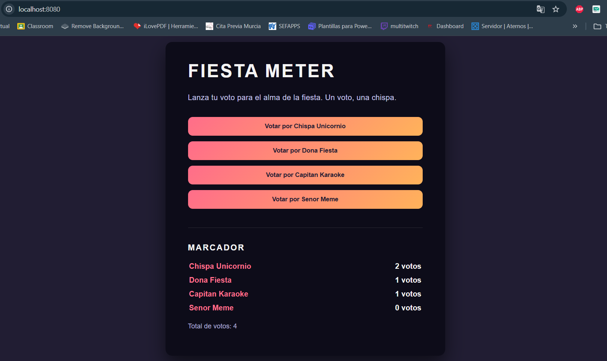

# Practica: Fiesta Meter — Flask + Gunicorn + Nginx

## Comandos utilizados

### Dockerfile
```
FROM python:3.14.0-alpine3.22
WORKDIR /app
COPY requirements.txt .
RUN pip install --no-cache-dir -r requirements.txt
COPY . .
EXPOSE 8000
CMD ["gunicorn", "-b", "0.0.0.0:8000", "wsgi:app"]
```

### Construir imagen

`docker build -t viaje-estudios .`

### Crear red Docker

`docker network create webnet`

### Ejecutar la app en esa red

`docker run -d --name fiesta_app --network webnet viaje-estudios`

### Verificar escucha de Gunicorn en 0.0.0.0:8000

`docker logs fiesta_app`

### Configurar como reverse_proxy. Creación de archivo default.conf (incluyendo cabeceras de seguridad)

```
server {
    listen 80;
    server_name app.localhost;

    location / {
        proxy_pass http://fiesta_app:8000;
        proxy_set_header Host $host;
        proxy_set_header X-Real-IP $remote_addr;
        proxy_set_header X-Forwarded-For $proxy_add_x_forwarded_for;
        proxy_set_header X-Forwarded-Proto $scheme;
        add_header X-Content-Type-Options "nosniff";
        add_header X-Frame-Options "DENY";
    }
}
```

### Ejecutar el contenedor Nginx

```
docker run -d --name nginx_proxy \
  --network webnet \
  -p 8080:80 \
  -v ./nginx/default.conf:/etc/nginx/conf.d/default.conf:ro \
  nginx:1.27-alpine
```

## App funcionando en http://localhost:8080/



## Flask y Nginx

Flask no se expone directamente porque su servidor está pensado para el desarrollo. Además la app quedaría expuesta directamente a Internet y sin control de tráfico ni seguridad. 

Por lo tanto, Gunicorn actúa entre medias de Flask y Nginx como servidor de producción, para entender el código Python que proviene de nuestra app Flask y gestionando varias peticiones a la vez.

Finalmente Nginx actúa como reverse proxy, esto significa que recibe las peticiones externas y las redirige a Gunicorn. También maneja varias conexiones simultáneas, añade cabeceras de seguridad...